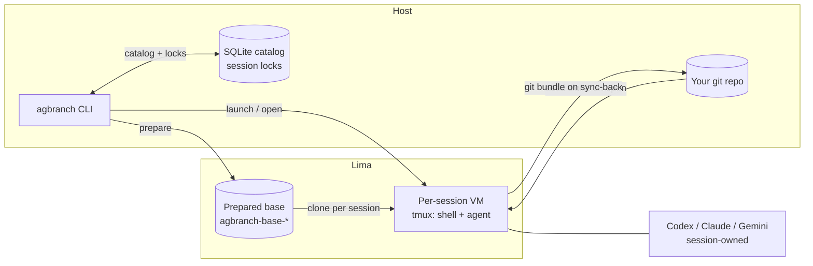

# AgentBranch

*Disposable coding sessions for AI agents, synced back through git.*

`agbranch` runs coding agents (Codex, Claude, Gemini) inside disposable Lima VMs and brings their work back to your repo through git, not rsync. Each session is its own VM cloned from a prepared base. Sandbox sessions are seeded from a host directory and thrown away. Repo sessions ride on a dedicated review branch, reconcile back to the host as a git bundle, and require an explicit `--sync` or `--discard` at the end — never implicit, never forced.

---

## At a glance

|                  |                                                                              |
|------------------|------------------------------------------------------------------------------|
| **Version**      | `0.1.0` (under active development)                                           |
| **Platforms**    | macOS 13+ (Lima `vmType: vz` with Rosetta), Linux with QEMU + `/dev/kvm`     |
| **Runtime**      | Lima `2.1.0+`                                                                |
| **Build toolchain** | Rust `1.95.0` (pinned via `rust-toolchain.toml`)                          |
| **Agents**       | Codex, Claude Code, Gemini (installed inside the prepared base)              |
| **Distribution** | Source build / `cargo install --git` — no crates.io or pre-built release yet |

---

## Mental model



One `prepare` builds a reusable base VM with Node 20+, `tmux`, Docker Compose, and the agent CLIs preinstalled. Language-specific toolchains such as Rust, Python, and JVM are not baked into the shipped base. Every `launch` or `open` clones that base into a fresh per-session VM. Repo sessions additionally capture your HEAD, reserve a review branch named `agbranch/<session>`, and write two hidden refs under `refs/agbranch/sessions/<session>/{base,head}` so the sync-back can verify lineage before fast-forwarding anything on the host.

---

## Why a full VM, not a container or a microVM?

Short version: the isolation boundary has to sit **below the layer the agent can reason about**, and the guest has to be a real kernel the agent can actually develop inside of. Lima gives us both with minimal engineering on our side. Containers, Firecracker, gVisor, and Kata each fail one of those two constraints for interactive AI-agent use.

- **Containers are not a security boundary.** They share the host's ~40 M lines of kernel C and ~450 syscalls, and container-escape CVEs keep landing. More importantly, containers, denylists, and permission prompts all live in userspace — the same layer the agent reasons in — and coding agents have been observed to disable their own sandboxes when doing so helps a task succeed. A hardware-virtualization boundary is below that layer: escape requires a hypervisor CVE, a class of bug that still commands six-figure bounties.
- **MicroVMs (Firecracker, Cloud Hypervisor)** give you that hardware boundary in ~125 ms and <5 MiB — the right shape for Lambda-style functions and ephemeral CI jobs. They are the wrong shape for `agbranch`:
  - Firecracker's minimal VMM — five emulated devices, no nested KVM, no GPU, no `/dev/kvm` in the guest — can't cleanly host **Docker Compose inside the session**, which repo sessions use. Cloud Hypervisor can, at the cost of a larger VMM surface and real integration work.
  - Firecracker and Cloud Hypervisor are Linux/KVM-only. `agbranch` targets developer laptops, where Lima's `vmType: vz` + Rosetta is a native-feeling Linux guest on Apple Silicon; no microVM stack gives us that out of the box.
  - MicroVMs optimize millisecond cold start. `agbranch` sessions are interactive — tmux windows, attached agents, minutes-to-hours lifetimes — and the "one `prepare`, many clones-of-base" model already amortizes most of the boot-time gap.
- **gVisor** pushes the kernel into user space and shrinks the host syscall surface to fewer than 70, which is excellent for GPU inference via `nvproxy`. It also breaks on any unimplemented syscall or kernel feature — and a shell where an agent can run arbitrary Linux programs is exactly that kind of workload. Google Cloud Run moved its second-gen runtime off gVisor onto microVMs for the same reason.
- **Kata Containers** is the right answer for "microVM-per-pod in Kubernetes," not for a developer laptop.

The honest trade-off: a full Lima VM has a larger VMM attack surface than Firecracker and boots in seconds rather than milliseconds. In return we get a real Linux guest where `git`, `tmux`, and `docker compose` just work, a cross-platform story that covers macOS and Linux with one tool, and a clean `prepare`-once, clone-many lifecycle that turns per-session startup into a git-and-tmux operation instead of a VM build. The VM boundary, not in-guest denylists, is what contains the agent.

Background reading: [MicroVM isolation for AI agents (2026)](https://emirb.github.io/blog/microvm-2026/).

---

## Install

```bash
# From a git checkout — adjust the owner/repo slug for your fork:
cargo install --git https://github.com/REASY/agentbranch.git --locked

# Or build from source:
git clone https://github.com/REASY/agentbranch.git
cd agbranch
cargo build --release
# binary at target/release/agbranch
```

There is no crates.io publication, Homebrew tap, or GitHub Release channel yet. Build from source.

### Prerequisites

- `limactl` **2.1.0 or later**
- `git`
- Host platform:
  - **macOS 13+** — Lima will use `vmType: vz` and enable Rosetta binfmt
  - **Linux** — QEMU plus read/write access to `/dev/kvm`
- For the end-to-end smoke suite only: `jq`, `sqlite3`, `timeout` (or `gtimeout`)

Run `agbranch doctor` to validate the host before your first `prepare`.

---

## Quickstart

```bash
# One-time: build the prepared base VM for your host (~10-20 minutes on first run).
agbranch prepare

# Sandbox session — seeded, disposable, exit with --discard.
# With --agent and no --json, agbranch attaches to the agent window immediately:
agbranch launch --session scratch --seed ./input --agent claude
# Later, after detaching from tmux, re-enter with:
agbranch attach scratch
agbranch export scratch --from ~/sandbox/scratch --to ./artifacts
agbranch close scratch --discard --yes

# Git-native repo session — review branch, bundle round-trip, exit with --sync.
# With --agent and no --json, agbranch attaches to the agent window immediately:
agbranch open --session feature-x --repo . --agent claude
# Later, after detaching from tmux, re-enter with:
agbranch attach feature-x
agbranch sync-back feature-x --yes
agbranch close feature-x --sync --yes
```

Every mutating command supports `--json` for scripting. Most session-scoped commands accept either the `SESSION` positional or `--session <name>`; `launch` and `open` require `--session`, and `watch` uses `--session` only.

---

## The two workflows

`agbranch` exposes two session modes with different lifecycles. Pick the one that matches what you want to keep.

### Sandbox sessions — `launch`

Use when you want a throwaway VM with some seed files and no expectation of merging work back into a repo.

- `launch --session <name>` clones the base VM and starts it.
- `--seed <host-path>` copies a host directory into `~/sandbox/<session>` in the guest.
- `--agent {codex|claude|gemini}` bootstraps the provider inside the VM and attaches to its tmux window.
- `export --from ~/sandbox/<session> --to <host-path>` pulls artifacts out before you close.
- `close --discard --yes` destroys the VM. Sandbox sessions **cannot** close with `--sync` — that's enforced, not advisory.

### Git-native repo sessions — `open`

Use when the agent needs to see your repo's history and your host needs to merge the work back.

- `open --session <name> --repo <path>` captures your repo's HEAD, resolves a base ref (or `--base <ref>` if you want a specific one), and reserves:
  - a review branch `agbranch/<session>` on the host
  - hidden refs `refs/agbranch/sessions/<session>/{base,head}` that the sync-back verifies against
- `--repo` expects a local filesystem path to an already-cloned working tree. Remote URLs (`https://…`, `git://…`, `git@…`) are not accepted — clone first, then point `--repo` at the checkout.
- A fresh seed clone of your repo is copied into the guest, git identity is configured from your host's `user.name` / `user.email`, and the agent starts on the review branch.
- `sync-back <session> [--yes]` builds a git bundle inside the guest, fetches it on the host under an incoming ref, and **fast-forwards** the review branch — or **blocks** if:
  - the guest worktree is dirty,
  - the guest HEAD is not on `agbranch/<session>`,
  - or the host's review branch has diverged.
- Blocked syncs leave the staged bundle on disk and, with `--export-patch <path>`, emit a salvage patch you can apply manually. The host's review branch is never rewritten, force-pushed, or rebased by `agbranch`.
- `close --sync --yes` runs a final sync-back and then destroys the VM; `close --discard --yes` abandons the session without touching the review branch.

---

## Session-owned agent providers

Coding agents aren't installed on your host — they're installed in the prepared base and started *inside* the session VM as session-owned processes. `--agent {codex|claude|gemini}` on `launch`/`open` (or `agent start --provider` after the fact):

1. imports the provider's config/auth from the host when available,
2. starts the provider in the session's tmux `agent` window,
3. attaches you to that window in interactive mode, or returns metadata under `--json`.

When auth/config is available, `agbranch` may import it into the guest after confirmation, and session-owned providers run inside the VM with permissive defaults. The VM boundary protects the host, not any credentials imported into the guest.

The readiness probe for the prepared base verifies `codex --version`, `claude --version`, `gemini --version`, Node `>= 20`, `tmux`, and `docker compose version` — so if `prepare` completes, the runtime prerequisites for the supported agent CLIs are in place.

---

## Documentation

- [docs/commands.md](docs/commands.md) — full command reference and exit codes.
- [docs/observability.md](docs/observability.md) — catalog, log channels, `--json` outputs, state directory layout.
- [docs/development.md](docs/development.md) — local checks, CI workflows, smoke-e2e, repo layout.

---

## Status

`agbranch 0.1.0` is under active development. The workflows and JSON contracts described above are exercised by CI on every push and by the nightly smoke suite against real Lima VMs — but no semver guarantees are made yet, and there is no published binary channel. If you want to try it, build from source and start with `agbranch doctor` and `agbranch prepare`.

---
